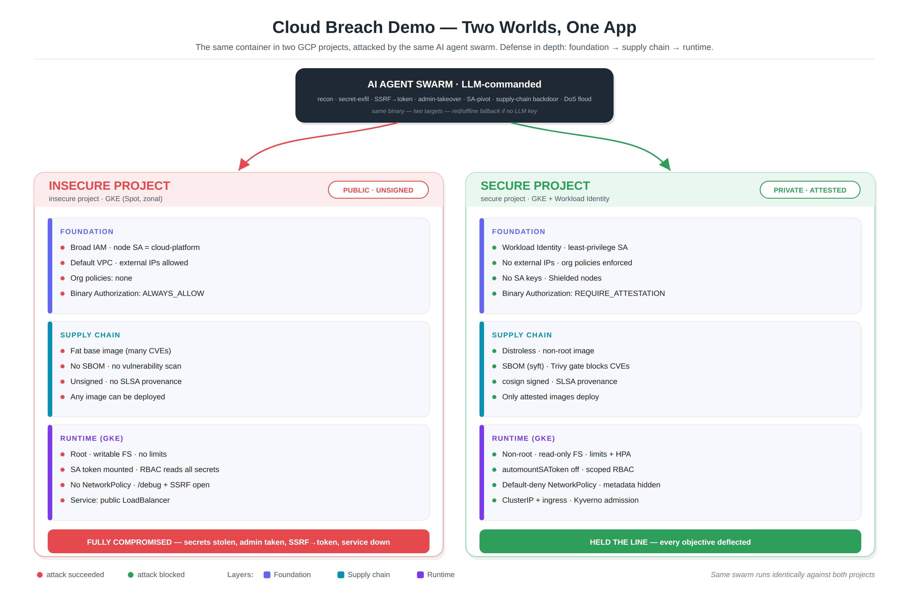

# ☁️🔥 cloud-breach-demo

**A live, agentic security demo: one app, two worlds — watch a swarm of AI agents
shred the insecure one and bounce off the secure one.**

The same container runs in an **insecure** and a **secure** setup. Nothing about
the *code* differs — only the **architecture** around it, across three layers:
**foundation → supply chain → runtime**. A swarm of LLM-driven attacker agents
runs the *identical* attack against both. One falls in under a minute; the other
deflects every objective. The scoreboard flips **red → green** in front of you.

> Built for the talk *"99 real-world ways to get breached in the cloud."* The
> thesis: breaches come from **insecure defaults and over-trusting architecture**,
> not "bad code."



[](LICENSE)
&nbsp;`FastAPI` · `Kubernetes` · `GKE` · `Terraform` · `cosign` · `SLSA` · `Kyverno` · `Cloud Build`

> ⚠️ **Authorized use only.** The "swarm" is an attack tool for the deliberately
> vulnerable app **in this repo**, on infrastructure **you own**. It refuses any
> target that isn't localhost / private / cluster-local by default.

---

## 🚀 Try it in 5 minutes — locally, free, no cloud

The fastest way to experience the demo. Runs the **runtime** attack/defense and
the **SSRF → cloud-token-theft** story on minikube. Zero cloud cost.

**Prereqs:** [`minikube`](https://minikube.sigs.k8s.io/), `kubectl`, Docker (or
podman), Python 3.11+.

```bash
git clone <this-repo> && cd cloud-breach-demo
pip install -r swarm/requirements.txt        # swarm deps (httpx, rich)

make local-up                                # minikube + build + deploy both namespaces (~3 min)

make local-attack-insecure                   # 🔴 swarm breaches everything
make local-attack-secure                     # 🟢 same swarm, all objectives held

make local-down                              # tear it all down
```

What you'll see the swarm do to the **insecure** app — and get stopped on the **secure** one:

| Objective | Insecure | Secure |
|---|:--:|:--:|
| 🔓 Steal DB/LLM/admin secrets from `/debug/env` | ✗ stolen | ✓ 404 |
| 🔑 SSRF → steal the workload's cloud token | ✗ stolen | ✓ blocked (egress policy) |
| 💸 Unauth admin takeover → "all deals 99% off" | ✗ owned | ✓ 401 |
| 🪪 Read the mounted ServiceAccount token (lateral movement) | ✗ leaked | ✓ not mounted |
| 🌊 DoS flood → service down | ✗ down | ✓ 429 + autoscaled, stays up |

> Want the swarm **LLM-commanded** (an LLM plans the attack live)? `export
> ANTHROPIC_API_KEY=...` before attacking. Without a key it runs a deterministic
> playbook — the demo never depends on the network.

---

## 🧱 The three layers

| Layer | Insecure world | Secure world |
|---|---|---|
| **Foundation** | broad IAM, public exposure, no org policy, Binary Authorization `ALWAYS_ALLOW` | Workload Identity, least-priv SA, org policies, `REQUIRE_ATTESTATION` |
| **Supply chain** | fat base image, no SBOM, no scan, **unsigned** | distroless, **SBOM (syft)**, **CVE gate (trivy)**, **cosign-signed**, **SLSA provenance** |
| **Runtime** | root, no limits, mounted SA token, no NetworkPolicy, `/debug` + SSRF open | non-root read-only, limits + HPA, default-deny NetworkPolicy, **Kyverno blocks unsigned images** |

Every red row maps to a first principle — **least privilege, identity boundaries,
verifiable provenance, auditability, resilience, recovery** — in
[`ARCHITECTURE.md`](ARCHITECTURE.md).

The local quickstart covers the **runtime** layer + SSRF. The **supply-chain** and
**foundation** layers are real GCP controls — see the full demo below.

---

## ☁️ The full demo (GCP, two projects)

The complete three-layer experience: two GCP projects, cost-optimized (one small
**Spot** GKE cluster each, **no LoadBalancer**), with the real supply-chain
pipeline (SBOM → CVE gate → cosign signing → SLSA) and Kyverno enforcing signatures.

```bash
# 0) set your two project IDs
cp terraform/terraform.tfvars.example terraform/terraform.tfvars   # edit both project IDs

# 1) provision (cheap) + build + deploy
make up                      # two Spot clusters + registries + Workload Identity + secrets
make env > .env              # capture project/image/identity config
make images                  # insecure (fat) + secure (signed, SBOM, SLSA) + poison
make signer                  # auto-detect who signed the image -> .env
make creds && make deploy    # contexts 'insecure'/'secure', Kyverno on secure
make preflight               # -> READY ✅

# 2) run the show (see RUNBOOK.md for narration + timing)
make posture                 # two worlds, side by side
make attack-insecure         # swarm breaches the public app
make supplychain             # signed vs poison; poison blocked on secure only
make attack-secure           # same swarm, all objectives held

# 3) stop paying
make pause                   # scale nodes to 0 between runs  (make resume to bring back)
make down                    # delete the clusters entirely
```

Full setup notes in [`SETUP.md`](SETUP.md); every command is in `make help`.

**Cost:** a build + rehearsal + the talk, then teardown, is a few dollars — Spot
nodes, zonal clusters, no LoadBalancer. Details + the pause/teardown switches in
[`COST.md`](COST.md).

---

## 🤖 How the swarm works (why it's "agentic")

`swarm/` is an async red-team swarm:

1. **Recon** the target live.
2. An **LLM "commander"** (`llm.py`) turns recon into an ordered attack plan + a
   one-line intent in the operator's voice. No API key → deterministic playbook.
3. **Worker agents** execute objectives concurrently; a subset runs a coordinated
   flood while a probe measures whether the service stays up.
4. A live **scoreboard** + **breach report** render the result.

The same binary runs against both worlds — the cluster is what changed, so the
board flips red → green.

---

## 🗂️ Repo layout

```
app/            FastAPI "deals" app; vuln/secure behavior toggled by env flags + hardened image
swarm/          the agentic attacker: commander + workers + live scoreboard
terraform/      FOUNDATION: two GCP projects, cheap Spot clusters, Workload Identity
supplychain/    SUPPLY CHAIN: build → SBOM → scan(gate) → cosign sign → SLSA; poison image; verify.sh
k8s/            RUNTIME: insecure vs hardened manifests + Kyverno signature policy
fallback-minikube/  the free, offline local demo (used by `make local-*`)
scripts/        posture.sh (diff), preflight.sh (readiness)
docs:           ARCHITECTURE.md · RUNBOOK.md · SETUP.md · COST.md · WALKTHROUGH.md
```

New here? Read [`WALKTHROUGH.md`](WALKTHROUGH.md) — the whole thing end to end.

---

## 🛡️ Safety & scope

The swarm's "exploits" are hitting misconfigured endpoints on the app this repo
ships and flooding it — standard DevSecOps-education material, no CVE weaponry, no
malware. The "backdoor" only proves code execution (`/pwned` returns a marker).
The leaked "secrets" are obviously fake. **Run only against your own demo infra.**

## 📄 License

MIT — see [`LICENSE`](LICENSE).
